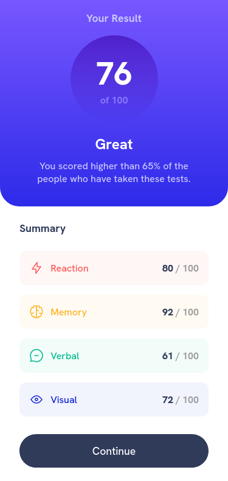
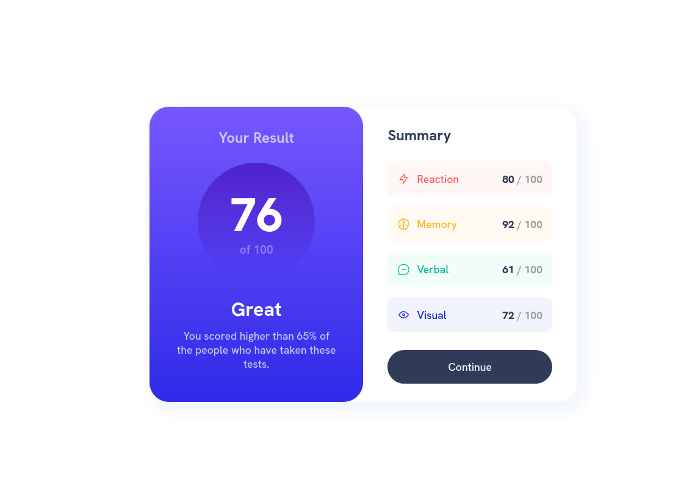

# Frontend Mentor - Results summary component solution

This is a solution to the [Results summary component challenge on Frontend Mentor](https://www.frontendmentor.io/challenges/results-summary-component-CE_K6s0maV). Frontend Mentor challenges help you improve your coding skills by building realistic projects.

## Table of contents

- [Overview](#overview)
  - [The challenge](#the-challenge)
  - [Screenshot](#screenshot)
  - [Links](#links)
- [My process](#my-process)
  - [Built with](#built-with)
  - [What I learned](#what-i-learned)
- [Author](#author)

## Overview

### The challenge

Users should be able to:

- View the optimal layout for the interface depending on their device's screen size
- See hover and focus states for all interactive elements on the page

### Screenshot




### Links

- Solution URL: [Solution URL](https://www.frontendmentor.io/solutions/responsive-results-summary-using-flexbox-l3wFZk2SMt)
- Live Site URL: [Github Pages URL](https://loganf50.github.io/results-summary/)

## My process

### Built with

- Semantic HTML5 markup
- CSS custom properties
- Flexbox
- Mobile-first workflow

### What I learned

- how to use flex more effectively to get flex items to take up same width:

```css
.summary {
  flex: 1 1 0; /* makes flex items take up same width */
}
```

- how to import and use a variable font from a file:

```css
@font-face {
  font-family: HankenGrotesk;
  src: url(../assets/fonts/HankenGrotesk-VariableFont_wght.ttf);
}
```

## Author

- Frontend Mentor - [@LoganF50](https://www.frontendmentor.io/profile/LoganF50)
